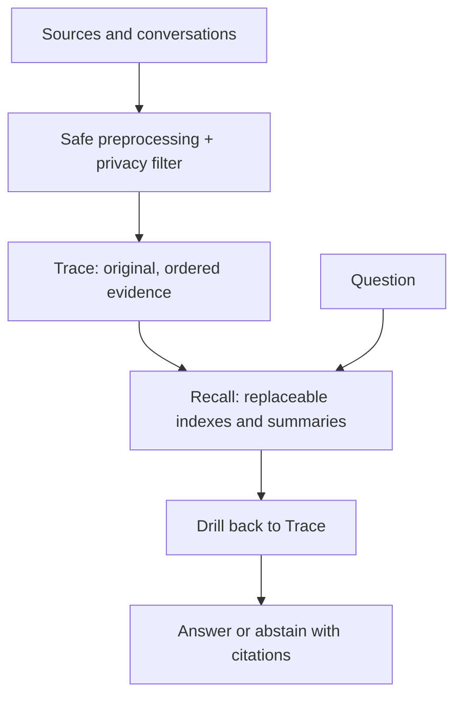

<div align="center">
  <a href="https://github.com/shanmukh05/trisynapse-memory">
    
  </a>

  <h1>Trisynapse Memory</h1>

  <p><strong>Store traces. Recall meaning.</strong></p>

  <p>
    <a href="https://github.com/shanmukh05/trisynapse-memory/actions/workflows/test.yml"></a>
    <a href="https://pypi.org/project/trisynapse-memory/"></a>
    <a href="https://pypi.org/project/trisynapse-memory/"></a>
    <a href="LICENSE"></a>
    
  </p>

  <p>
    <a href="#install">Install</a> ·
    <a href="#start-in-the-terminal">CLI</a> ·
    <a href="#python-in-five-minutes">Python</a> ·
    <a href="#rest-api-and-memory-studio">REST &amp; Studio</a> ·
    <a href="#javascript-and-typescript-sdk">TypeScript</a> ·
    <a href="docs/architecture.md">Architecture</a> ·
    <a href="docs/api.md">API</a> ·
    <a href="docs/operations.md">Operations</a>
  </p>
</div>

---

Trisynapse Memory is a local-first memory layer for AI agents. It keeps original evidence in a verifiable **Trace**, builds replaceable **Recall** views for fast retrieval, and answers from the evidence with citations.

> [!IMPORTANT]
> **Project status: pre-1.0 alpha.** The Python engine, unified source ingestion, REST API, TypeScript client, Memory Studio, full terminal, durable jobs, provider adapters, and benchmark runners are implemented. APIs may still change before the first stable release.

## Install

macOS or Linux:

```bash
curl -LsSf https://github.com/shanmukh05/trisynapse-memory/releases/latest/download/install.sh | sh
```

Windows PowerShell:

```powershell
irm https://github.com/shanmukh05/trisynapse-memory/releases/latest/download/install.ps1 | iex
```

The installer uses `uv`, installs the PyPI package with all user-facing source loaders, adds the single `trisynapse-memory` command, records install metadata, and runs `check`. Re-run it to upgrade.

Or install from PyPI:

```bash
pip install 'trisynapse-memory[all]'
```

Python 3.11+ is required. Uninstall with `uv tool uninstall trisynapse-memory` or the matching `pip uninstall` command.

## Start in the terminal

```bash
trisynapse-memory init
trisynapse-memory
```

With no arguments in a terminal, the interactive app opens. Ask a question as plain text, or use commands such as `/ingest`, `/sources`, `/search`, `/history`, `/forget`, `/remove`, `/jobs`, `/model`, and `/check`.

Start typing `/` to see live command recommendations. The list narrows with every character, while a ghost completion appears in the prompt. Press **Tab** or **Right Arrow** to accept it. Commands that need an argument also recommend matching local paths or recent memory IDs.

Scriptable commands remain available:

```bash
trisynapse-memory --project-id demo ingest ./docs ./src/service.py https://example.com/guide
trisynapse-memory --project-id demo sources list
trisynapse-memory --project-id demo query "How does the service work?"
trisynapse-memory --json check
```

Global flags include `--json`, `--quiet`, `--no-color`, `--yes`, `--path`, namespace flags, and `--version`. Put global flags before the command. JSON mode never prints the logo or progress text.

## Python in five minutes

```python
from trisynapse_memory import MemoryEngine, MemoryNamespace, SourceInput

namespace = MemoryNamespace(user_id="maya", project_id="assistant")
memory = MemoryEngine.from_env("~/.trisynapse-memory/store", namespace=namespace)

memory.add("Maya prefers short weekly updates.", episode_id="chat:1")

run = memory.ingest_many([
    SourceInput(kind="file", path="./handbook.pdf"),
    SourceInput(kind="directory", path="./src", source_key="app-source"),
    SourceInput(kind="url", url="https://example.com/release-process"),
])

for item in run.results:
    print(item.index, item.status, item.source_id, item.error)

answer = memory.query("How should I write the weekly update?")
print(answer.answer)
for citation in answer.citations:
    print(citation.delta_id, citation.locator)
```

Mixed imports are independent: a bad item is reported as failed while valid items commit. Repeating the same `source_key + content_hash` is a no-op. Updating a source creates a new version and retracts the previous version only after the new one succeeds.

`add_batch()` still means “append already-normalized text observations.” Use `ingest_many()` for mixed files, URLs, repositories, archives, and images.

## Sources

The source pipeline accepts:

- text, Markdown, HTML, PDF, JSON, JSONL, YAML, and CSV;
- DOCX, PPTX, and XLSX with paragraph, slide, sheet, row, and cell-aware locations;
- PNG, JPEG, and WebP through the configured vision-capable completion model;
- code files, directories, safe ZIP/TAR archives, notebooks, and public HTTPS Git repositories;
- one public web page per URL.

Code is split around symbols with Tree-sitter when supported, with bounded line chunks as the fallback. Citations retain paths, languages, symbol names/types, line ranges, imports, hashes, and Git commit metadata. Repository imports honor `.gitignore` and `.trisynapseignore`; dependencies, builds, caches, secret files, binaries, and symlinks are skipped and reported.

Accepted originals are deduplicated by SHA-256 under the memory store and included in backups. Store permissions are restricted, but **the source store is not encrypted**.

Image ingestion does not silently switch to OCR. It fails clearly if no completion provider is configured or the selected model rejects images.

## Forget versus remove

```python
memory.forget(delta_id=item.id, reason="no longer relevant")
memory.remove(delta_ids=[item.id], reason="approved privacy deletion")
memory.remove_source(source_id, reason="delete upload and derived memory")
```

- `forget()` appends a logical retraction. The old content remains available to authorized audit/history operations.
- `remove()` physically redacts only the selected deltas, writes `[REMOVED]`, rebuilds the verifiable chain, clears derived caches, and records a `removal_audit` row.
- `remove_source()` removes the retained original when it is no longer shared and redacts every delta derived from that source.

There is intentionally no public `purge` alias. Historical `[PURGED]` rows from older stores remain unchanged and continue to verify.

## One engine, four surfaces

| Surface | Start | Best for |
|---|---|---|
| Python | `MemoryEngine.from_env(...)` | In-process applications |
| Terminal/CLI | `trisynapse-memory` | Interactive use, scripts, and operations |
| REST + Studio | `trisynapse-memory serve --studio` | Shared local service and inspection |
| JavaScript/TypeScript | `@trisynapse/memory` | Node.js and web application backends |

All surfaces call the same Trace & Recall engine. A source ingested through REST is visible from Python, the terminal, Studio, and TypeScript when they use the same store and namespace.

## REST API and Memory Studio

Install the server extra, initialize the store, and start the service:

```bash
pip install 'trisynapse-memory[server,sources]'
trisynapse-memory init
trisynapse-memory serve --studio
```

The default service address is `http://127.0.0.1:8765`. The root opens Memory Studio at [`/studio/`](http://127.0.0.1:8765/studio/), while OpenAPI is available at [`/openapi.json`](http://127.0.0.1:8765/openapi.json). The service binds to loopback unless `--host` is changed.

Studio has five focused areas:

- **Sources** is a searchable card inbox with mixed batch ingestion, safe previews, retained-original downloads, versions, and derived memory.
- **Queries** streams each retrieval stage into a clickable workflow and keeps the same workflow in namespace-scoped history.
- **Memory Viewer** switches between knowledge, source-lineage, and chronological Trace graphs.
- **Configuration** manages completion, embeddings, and revisioned retrieval defaults.
- **Connection** selects the server, bearer token, and active namespace without storing the token in memory SQLite.

`init` creates the administrator bearer token at `<store>/.api-key`. Health is public; memory operations require the token when authentication is enabled:

```bash
export TRISYNAPSE_MEMORY_API_KEY="$(cat ~/.trisynapse-memory/store/.api-key)"

curl http://127.0.0.1:8765/api/v1/health

curl -X POST http://127.0.0.1:8765/api/v1/memory/observations \
  -H "Authorization: Bearer $TRISYNAPSE_MEMORY_API_KEY" \
  -H "Content-Type: application/json" \
  -d '{
    "text": "Maya prefers three-bullet updates.",
    "episode_id": "chat:updates",
    "namespace": {"user_id": "maya", "project_id": "demo"}
  }'

curl -X POST http://127.0.0.1:8765/api/v1/query \
  -H "Authorization: Bearer $TRISYNAPSE_MEMORY_API_KEY" \
  -H "Content-Type: application/json" \
  -d '{
    "question": "How should Maya receive updates?",
    "namespace": {"user_id": "maya", "project_id": "demo"}
  }'
```

### Ingest sources through REST

Bulk source ingestion is asynchronous. The first response is `202 Accepted` with a durable run ID:

```bash
curl -X POST http://127.0.0.1:8765/api/v1/sources/ingest \
  -H "Authorization: Bearer $TRISYNAPSE_MEMORY_API_KEY" \
  -H "Content-Type: application/json" \
  -d '{
    "namespace": {"user_id": "maya", "project_id": "demo"},
    "sources": [
      {"kind": "url", "url": "https://example.com/handbook"},
      {"kind": "text", "source_key": "release-rule", "text": "Name an owner in every release note."}
    ]
  }'
```

Follow and manage the run using its returned ID:

```bash
curl -H "Authorization: Bearer $TRISYNAPSE_MEMORY_API_KEY" \
  http://127.0.0.1:8765/api/v1/ingestion-runs/RUN_ID

curl -X POST -H "Authorization: Bearer $TRISYNAPSE_MEMORY_API_KEY" \
  http://127.0.0.1:8765/api/v1/ingestion-runs/RUN_ID/retry
```

Important REST routes:

| Area | Routes |
|---|---|
| Add and retrieve | `POST /memory/observations`, `POST /search`, `POST /query`, `GET /memories` |
| Query workflows | `POST/GET /query-runs`, `GET /query-runs/{id}/events`, confirmed history removal |
| Sources | `POST /sources/ingest`, filtered `GET /sources`, preview/content routes |
| Runs | `GET /ingestion-runs`, `GET /ingestion-runs/{id}`, retry |
| Memory graph | `GET /memory-graph`, node-neighborhood expansion |
| Lifecycle | corrections, `forget`, `POST /memory/remove`, `POST /sources/{id}/remove` |
| Models and retrieval | provider catalogs, `GET/PUT /model-configuration`, `GET/PUT /retrieval-configuration` |
| Operations | health, metrics, jobs, export, backups, benchmarks, and integration events |

All routes above are under `/api/v1`. Uploaded bytes are sent as `content_base64`. REST deliberately rejects arbitrary server filesystem paths. Defaults include 25 MiB per uploaded file, 250 MiB per run, 100 descriptors, safe archive limits, URL timeouts, redirect limits, and private-network blocking.

Use `trisynapse-memory serve --no-auth` only for trusted local development. See [API and Interfaces](docs/api.md) for complete request contracts and [Operations](docs/operations.md) for deployment guidance.

## JavaScript and TypeScript SDK

The dependency-free Fetch client lives in [`packages/js-sdk`](packages/js-sdk) and its package name is `@trisynapse/memory`. It requires Node.js 18+ or another runtime with a compatible Fetch API.

```bash
npm install @trisynapse/memory
# or: pnpm add @trisynapse/memory
```

```ts
import { TrisynapseMemory } from "@trisynapse/memory";

const memory = new TrisynapseMemory({
  baseUrl: "http://127.0.0.1:8765",
  apiKey: process.env.TRISYNAPSE_MEMORY_API_KEY,
  namespace: { project_id: "demo", user_id: "maya" },
});

await memory.add("Maya prefers short weekly updates.", {
  episodeId: "chat:updates",
});

const run = await memory.ingest([
  { kind: "url", url: "https://example.com/guide" },
  {
    kind: "file",
    filename: "release-notes.md",
    content_base64: markdownBase64,
    source_key: "release-notes",
  },
]);

let current = run;
while (current.status === "pending" || current.status === "running") {
  await new Promise(resolve => setTimeout(resolve, 500));
  current = await memory.getIngestionRun(run.id);
}

const answer = await memory.query("What does the guide require?");
console.log(answer.answer);
for (const citation of answer.citations) {
  console.log(citation.delta_id, citation.locator);
}
```

The client covers:

- `add()`, `addBatch()`, and the compatibility `addFile()`;
- `ingest()`, `listSources()`, `getSource()`, and `removeSource()`;
- `getIngestionRun()` and `retryIngestion()`;
- `search()`, `query()`, `list()`, `get()`, and `history()`;
- `correct()`, `forget()`, and physical `remove()`;
- profiles, feedback, health, typed deltas, citations, retrieval traces, sources, and run results.
- provider/model discovery, configuration, explicit connection tests, and embedding-rebuild status.

Lifecycle example:

```ts
await memory.correct(memoryId, "Maya prefers at most three bullets.");
await memory.forget(memoryId, "Preference expired");
await memory.remove([sensitiveMemoryId], "Approved privacy deletion");
await memory.removeSource(sourceId, "Delete the upload and derived memory");
```

The SDK contains no alternate memory algorithm; it is a typed client for the canonical Python REST service.

## The memory idea



Each Trace delta stores the hash of the previous delta plus its own content. Hashing does not hide the data. It answers a different question: “Was old evidence edited, deleted, reordered, or inserted outside the supported lifecycle?” Recall products can be rebuilt, so they never become the final evidence for an answer.

Read [Architecture](docs/architecture.md) first, then [API and Interfaces](docs/api.md), [Operations](docs/operations.md), and the [Production release runbook](docs/release-and-production.md).

Release versions are synchronized from `pyproject.toml` with one command:

```bash
uv run python scripts/version.py set 0.2.0
uv run python scripts/version.py check --tag v0.2.0
```

## Models, providers, and benchmarks

Model choices are saved per memory store. API keys stay in environment variables and are never written to SQLite. Running `/model` opens the searchable terminal selector:

```bash
export ANTHROPIC_API_KEY="your-key"
trisynapse-memory
# Enter /model completion
```

Scriptable equivalents are available:

```bash
trisynapse-memory models providers
trisynapse-memory models list --role completion --provider anthropic
trisynapse-memory models set completion anthropic claude-sonnet-4-5
trisynapse-memory models test --role completion
```

Completion providers are OpenAI, OpenRouter, Gemini, Anthropic, DeepInfra, DeepSeek, Kimi, and custom OpenAI-compatible endpoints. Embeddings can use local SentenceTransformers, OpenAI, OpenRouter, Gemini, DeepInfra, or a custom OpenAI-compatible endpoint. Qwen models appear under OpenRouter or DeepInfra when those catalogs provide them.

| Provider | Completion | Embedding | Credential variable |
|---|:---:|:---:|---|
| OpenAI | ✓ | ✓ | `OPENAI_API_KEY` |
| OpenRouter | ✓ | ✓ | `OPENROUTER_API_KEY` |
| Gemini | ✓ | ✓ | `GEMINI_API_KEY` |
| Anthropic | ✓ | — | `ANTHROPIC_API_KEY` |
| DeepInfra | ✓ | ✓ | `DEEPINFRA_API_TOKEN` |
| DeepSeek | ✓ | — | `DEEPSEEK_API_KEY` |
| Kimi | ✓ | — | `MOONSHOT_API_KEY` |
| OpenAI-compatible | ✓ | ✓ | `OPENAI_COMPATIBLE_API_KEY` when required |
| SentenceTransformers | — | ✓ | none |

Changing completion affects future generation only. Changing embeddings requires confirmation and rebuilds a new vector index before switching away from the working index. See [Operations](docs/operations.md#completion-and-embedding-providers) for credentials and [API and Interfaces](docs/api.md#model-configuration) for every configuration surface.

The same change from Python:

```python
from trisynapse_memory import ProviderSelection

configuration = memory.get_model_configuration()
configuration.completion = ProviderSelection(
    provider="deepseek", model="deepseek-chat"
)
memory.set_model_configuration(configuration)
```

Benchmark modes stay explicit:

- `retrieval` measures offline ingestion, retrieval, grounding, and extractive answers;
- `end-to-end` adds provider-backed extraction, Recall generation, answering, and judging.

Artifacts record provider/model and prompt version/hash provenance without credentials or provider URLs.

```bash
trisynapse-memory bench run locomo --mode retrieval --data-root data/locomo --max-questions 100
trisynapse-memory bench gate --mode retrieval
```

## Development

```bash
pip install -e '.[dev,all]'
pytest -q
ruff check src tests scripts
pnpm install --frozen-lockfile
pnpm --filter @trisynapse/memory check
```

Trace & Recall is the only engine implementation. License: Apache-2.0.
