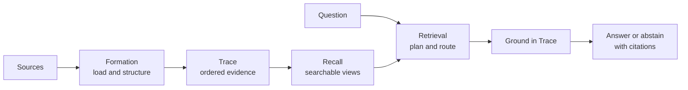

<div align="center">
  <a href="https://github.com/shanmukh05/trisynapse-memory">
    
  </a>

  <h1>Trisynapse Memory</h1>

  <p><strong>Store traces. Recall meaning.</strong></p>
  <p>Evidence-first memory for AI agents: ingest many kinds of data, retrieve the useful parts, and answer with citations.</p>

  <p>
    <a href="https://github.com/shanmukh05/trisynapse-memory/actions/workflows/test.yml"></a>
    <a href="https://pypi.org/project/trisynapse-memory/"></a>
    <a href="https://www.npmjs.com/package/@trisynapse/trisynapse-memory"></a>
    <a href="https://pypi.org/project/trisynapse-memory/"></a>
    <a href="LICENSE"></a>
    
  </p>

  <p>
    <a href="#quickstart">Quickstart</a> ·
    <a href="#choose-how-you-use-it">Interfaces</a> ·
    <a href="#how-memory-works">Architecture</a> ·
    <a href="docs/api.md">API</a> ·
    <a href="docs/operations.md">Operations</a> ·
    <a href="#release-notes">Releases</a>
  </p>
</div>

---

Trisynapse Memory is a local-first memory engine for assistants, agents, and applications. It preserves source evidence in an ordered **Trace**, builds searchable **Recall** views, and drills back to the evidence before returning an answer.

Use it when your application needs to remember conversations, documents, code, web pages, tables, images, or structured records—and you need to see where an answer came from.

### Why Trisynapse?

| Capability | What it means |
|---|---|
| **Source-aware** | Keeps pages, sections, rows, cells, files, symbols, line ranges, speakers, and timestamps. |
| **Grounded** | Answers from Trace evidence and returns citations—or abstains when confidence is too low. |
| **Inspectable** | Saves retrieval stages, candidates, decisions, timings, and model provenance as query runs. |
| **Local-first** | Runs with local embeddings and no completion API key by default. Add a provider only when you need generation or image understanding. |
| **One engine** | Python, CLI, REST, Studio, and TypeScript share the same store and namespace model. |

> [!IMPORTANT]
> Trisynapse Memory is a pre-1.0 alpha. Its core surfaces are implemented, but APIs and store schemas may still change between minor releases.

## Quickstart

### 1. Install

macOS or Linux:

```bash
curl -LsSf https://github.com/shanmukh05/trisynapse-memory/releases/latest/download/install.sh | sh
```

Windows PowerShell:

```powershell
irm https://github.com/shanmukh05/trisynapse-memory/releases/latest/download/install.ps1 | iex
```

Or install from PyPI:

```bash
pip install 'trisynapse-memory[all]'
```

Python 3.11 or newer is required. The first semantic search may download the default local embedding model. Re-run the installer to upgrade; uninstall with `uv tool uninstall trisynapse-memory`.

### 2. Store and recall something

```bash
trisynapse-memory init
trisynapse-memory add observation "Maya prefers three-bullet weekly updates."
trisynapse-memory query "How should I update Maya?"
```

No completion API key is required for this path. Without one, Trisynapse returns an extractive answer grounded in the retrieved evidence.

### 3. Open the interactive terminal

```bash
trisynapse-memory
```

Ask a question as plain text or enter `/` to browse commands. Suggestions narrow as you type; press **Tab** or **Right Arrow** to accept one. Useful commands include `/ingest`, `/sources`, `/history`, `/model`, `/remove`, and `/check`.

Ingest several source types together:

```bash
trisynapse-memory --project-id demo ingest \
  ./handbook.pdf ./src https://example.com/guide

trisynapse-memory --project-id demo query \
  "What does the handbook say about releases?"
```

Each source succeeds or fails independently. The run remains available for inspection and failed-item retries.

## Choose how you use it

| Surface | Start here | Best for |
|---|---|---|
| **Interactive terminal** | `trisynapse-memory` | Exploring memory, ingesting sources, and grounded questions |
| **Scriptable CLI** | `trisynapse-memory --help` | Automation, jobs, backups, validation, and benchmarks |
| **Python** | `MemoryEngine.from_env(...)` | In-process agents and applications |
| **REST + Studio** | `trisynapse-memory serve --studio` | A shared service and visual inspection |
| **TypeScript** | `npm install @trisynapse/trisynapse-memory` | Node.js or web backends calling the REST service |

### Python

```python
from trisynapse_memory import MemoryEngine, MemoryNamespace, SourceInput

namespace = MemoryNamespace(user_id="maya", project_id="assistant")
memory = MemoryEngine.from_env(namespace=namespace)

try:
    memory.add("Maya prefers short weekly updates.", episode_id="chat:1")

    memory.ingest_many([
        SourceInput(kind="file", path="./handbook.pdf"),
        SourceInput(kind="directory", path="./src"),
        SourceInput(kind="url", url="https://example.com/guide"),
    ])

    answer = memory.query("How should I write Maya's update?")
    print(answer.answer)
    for citation in answer.citations:
        print(citation.delta_id, citation.locator)
finally:
    memory.close()
```

Use `add()` and `add_batch()` for text that is already normalized. Use `ingest()` and `ingest_many()` for files, directories, URLs, repositories, archives, images, and mixed batches.

### REST and Memory Studio

```bash
trisynapse-memory init
trisynapse-memory serve --studio
```

Open [http://127.0.0.1:8765/studio/](http://127.0.0.1:8765/studio/). The API token is stored at `~/.trisynapse-memory/store/.api-key`; keep it private.

Studio gives you five focused views:

- **Sources** — browse, preview, ingest, retry, download, and remove sources.
- **Queries** — watch retrieval run step by step and reopen past workflows.
- **Memory Viewer** — explore knowledge, lineage, and chronological Trace graphs.
- **Configuration** — choose completion, embedding, and retrieval settings.
- **Connection** — select the server, token, and active namespace.

Health and OpenAPI are available at:

```text
GET http://127.0.0.1:8765/api/v1/health
    http://127.0.0.1:8765/openapi.json
```

See [API and interfaces](docs/api.md) for request contracts, asynchronous ingestion, SSE query runs, source previews, and graph endpoints.

### JavaScript and TypeScript

The TypeScript package is a dependency-free Fetch client for the REST service.

```bash
npm install @trisynapse/trisynapse-memory
```

```ts
import { TrisynapseMemory } from "@trisynapse/trisynapse-memory";

const memory = new TrisynapseMemory({
  baseUrl: "http://127.0.0.1:8765",
  apiKey: process.env.TRISYNAPSE_MEMORY_API_KEY,
  namespace: { project_id: "demo", user_id: "maya" },
});

await memory.add("Maya prefers short weekly updates.");
const answer = await memory.query("How should I update Maya?");

console.log(answer.answer);
console.log(answer.citations);
```

The client also covers mixed ingestion, source previews, query runs, memory graphs, lifecycle operations, model selection, retrieval configuration, and connection checks.

## How memory works



1. **Formation** loads a source and keeps its useful structure.
2. **Trace** stores the resulting evidence in order with provenance and lifecycle state.
3. **Recall** builds replaceable indexes, graph connections, episode views, and compiled claims.
4. **Retrieval** searches several routes, fuses candidates, and drills back to Trace.
5. **Grounding** creates an answer with citations or abstains.

Trace is an application data store, not a cryptographic ledger. `validate` checks SQLite consistency, sequence continuity, evidence references, and retained source blobs. Recall data can be rebuilt; cited evidence always comes from Trace.

[Read the architecture guide →](docs/architecture.md)

## Sources and retrieval

<details>
<summary><strong>Supported source types</strong></summary>

| Category | Sources |
|---|---|
| Documents | Text, Markdown, HTML, PDF, DOCX, and PPTX |
| Structured data | JSON, JSONL, YAML, CSV, and XLSX |
| Code | Files, directories, repositories, notebooks, ZIP, and TAR archives |
| Media | PNG, JPEG, and WebP with a vision-capable completion model |
| Network | One public web page or public HTTPS Git repository per source |

Code keeps repository paths, languages, symbols, imports, line ranges, file identity, and Git provenance. Repositories honor `.gitignore` and `.trisynapseignore`. Tables keep sheets, rows, and cells; documents keep pages and sections; conversations keep speakers and timestamps.

Accepted originals are retained in content-addressed storage and included in backups. The store is permission-restricted but **not encrypted at rest**.

</details>

<details>
<summary><strong>Retrieval routes and query history</strong></summary>

Trisynapse can route a question through lexical, semantic, temporal, graph, code, table, image, document, and conversation retrieval. It fuses and reranks candidates under per-source and total context budgets before grounding.

Every query run can retain executed steps, route candidates, scores, decisions, durations, citations, retrieval configuration, prompt provenance, and provider/model provenance. It never stores API keys, authorization headers, embeddings, hidden model reasoning, or full system prompts.

</details>

## Models are optional

The default setup uses local SentenceTransformers embeddings and no completion provider. Add completion when you want generated answers, richer extraction and Recall, or image understanding.

```bash
export ANTHROPIC_API_KEY="your-key"
trisynapse-memory models set completion anthropic claude-sonnet-4-5
trisynapse-memory models test --role completion
```

Or run the interactive terminal and enter `/model` to search provider catalogs and select models.

<details>
<summary><strong>Supported providers and credential variables</strong></summary>

| Provider | Completion | Embedding | Credential |
|---|:---:|:---:|---|
| OpenAI | ✓ | ✓ | `OPENAI_API_KEY` |
| OpenRouter | ✓ | ✓ | `OPENROUTER_API_KEY` |
| Gemini | ✓ | ✓ | `GEMINI_API_KEY` |
| Anthropic | ✓ | — | `ANTHROPIC_API_KEY` |
| DeepInfra | ✓ | ✓ | `DEEPINFRA_API_TOKEN` |
| DeepSeek | ✓ | — | `DEEPSEEK_API_KEY` |
| Kimi | ✓ | — | `MOONSHOT_API_KEY` |
| OpenAI-compatible | ✓ | ✓ | `OPENAI_COMPATIBLE_API_KEY` when required |
| SentenceTransformers | — | ✓ | None |

Qwen models appear through OpenRouter or DeepInfra when their live catalogs provide them. Model choices are stored per memory store; credentials remain environment-only.

Changing completion affects future work only. Changing embeddings on a non-empty store requires confirmation and builds a complete replacement index before switching. A failed rebuild leaves the old index active.

[Provider setup and model behavior →](docs/operations.md#completion-and-embedding-providers)

</details>

## Memory lifecycle

| Operation | Meaning |
|---|---|
| `correct()` | Add a replacement while preserving what changed. |
| `forget()` | Logically retract memory while retaining authorized history. |
| `remove()` | Physically redact selected memory content. |
| `remove_source()` | Remove an original source and all memory derived from it. |

Namespaces isolate memory by project and optionally by user, agent, and session. The same namespace rules apply to Python, CLI, REST, Studio, and TypeScript.

## Documentation

| Read this | When you need to… |
|---|---|
| [Architecture](docs/architecture.md) | Understand Formation, Trace, Recall, retrieval, graphs, and storage |
| [API and interfaces](docs/api.md) | Use Python, REST, SSE, TypeScript, or CLI contracts |
| [Operations](docs/operations.md) | Configure providers, deploy Studio, back up, restore, or troubleshoot |
| [Release notes](docs/releases/) | See what changed in each version |
| [Contributing](CONTRIBUTING.md) | Set up development and submit changes |
| [Security](SECURITY.md) | Understand the deployment boundary or report a vulnerability |

## Release notes

Published installers and packages are on [GitHub Releases](https://github.com/shanmukh05/trisynapse-memory/releases). Written notes for each version live in [`docs/releases/`](docs/releases/).

| Version | Notes |
|---|---|
| [v0.1.2](docs/releases/v0.1.2.md) | Retrieval profiles, token-aware grounding, store validation, and the `@trisynapse/trisynapse-memory` npm package. Includes breaking CLI, REST, and SDK renames. |
| [v0.1.1](docs/releases/v0.1.1.md) | Current published release. Installers pin 0.1.1; tagged releases always rebuild and publish. |
| [v0.1.0](docs/releases/v0.1.0.md) | First public alpha of the Trace & Recall engine. |

## Development and benchmarks

```bash
pip install -e '.[dev,all]'
pytest -q
ruff check src tests scripts

pnpm install --frozen-lockfile
pnpm --filter @trisynapse/trisynapse-memory check
pnpm --filter @trisynapse/studio test
```

Benchmark adapters support LoCoMo, LongMemEval, HaluMem, and MemoryDoc. Retrieval mode measures the evidence pipeline without answer-generation calls; end-to-end mode adds provider-backed formation, answering, and judging.

```bash
trisynapse-memory bench run locomo \
  --mode retrieval --data-root data/locomo --max-questions 100

trisynapse-memory bench gate --mode retrieval --data-root data
```

See the [benchmark operations guide](docs/operations.md) before treating a result as a release gate.

## License

[Apache 2.0](LICENSE)
