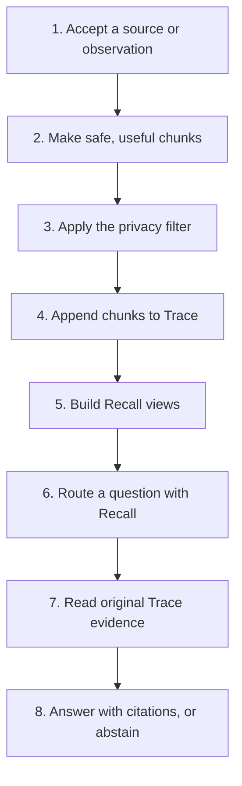
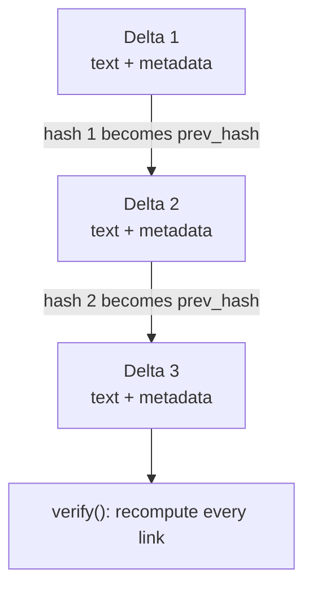
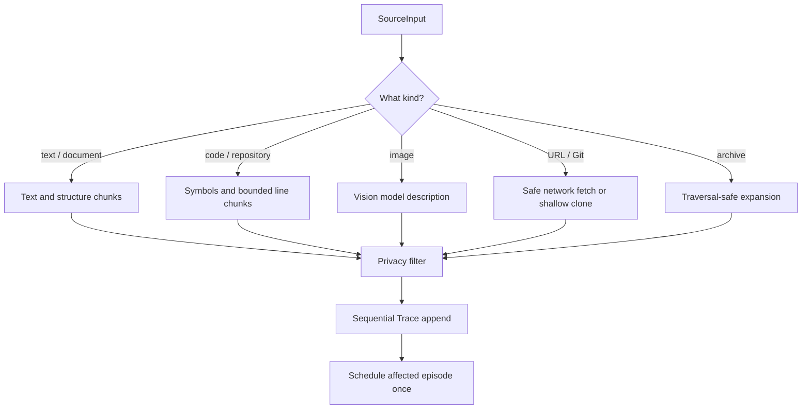
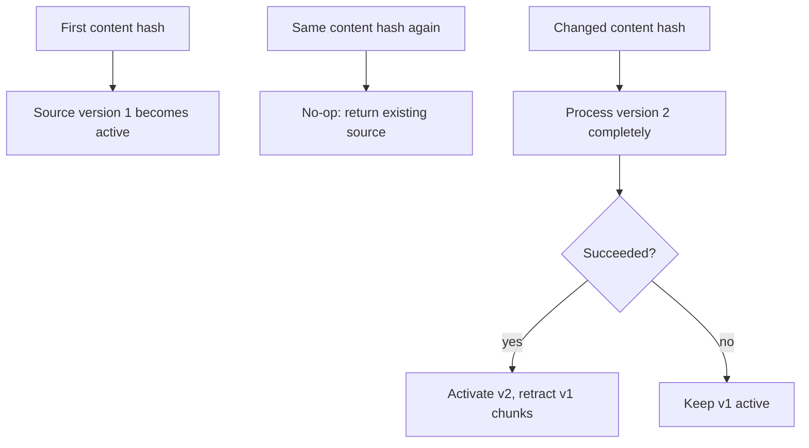
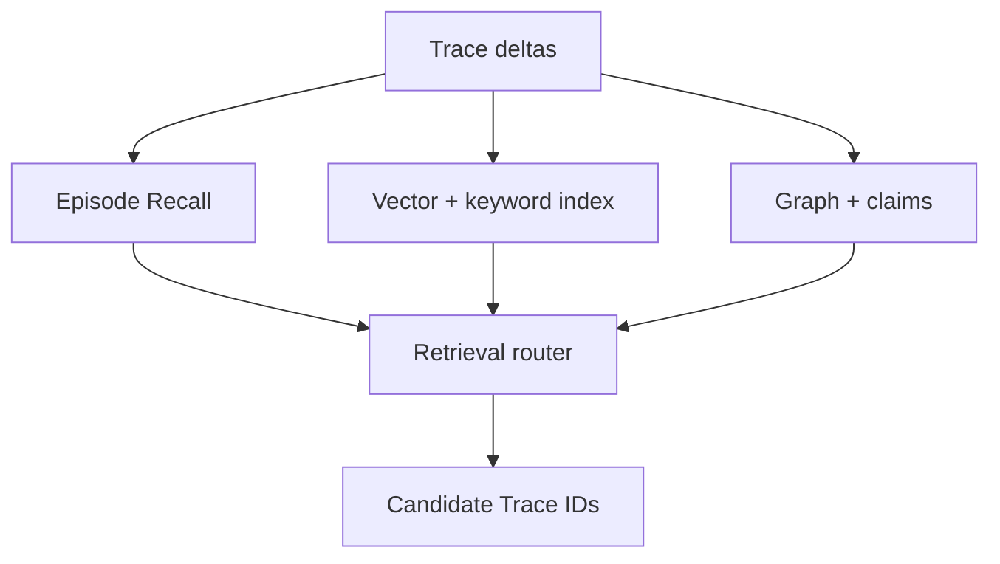
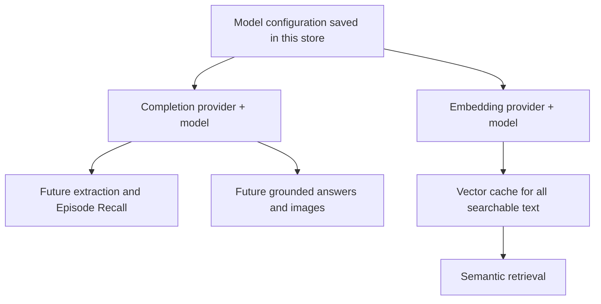
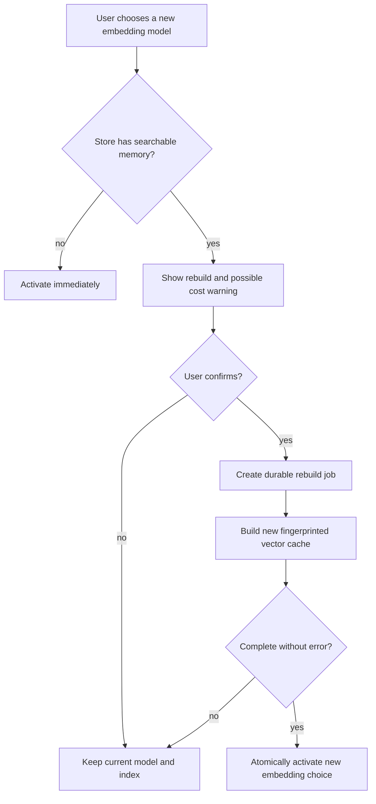
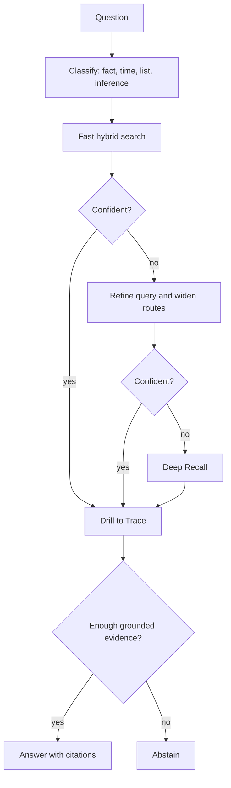
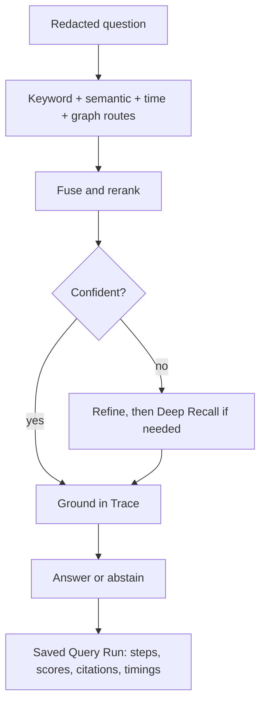
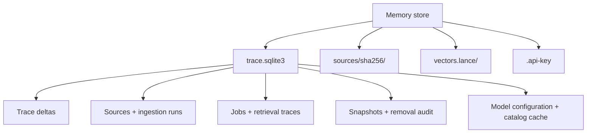

# How Trisynapse Memory Works

This is the main introduction to the Trisynapse memory architecture. You do not need to know the codebase first.

## The idea in one minute

An AI agent needs two things that pull in different directions:

1. a faithful record of what actually happened;
2. a fast way to find the small part that matters now.

Trisynapse separates them:

- **Trace** is the durable evidence: messages, source chunks, corrections, access records, and retractions.
- **Recall** is the replaceable help: vectors, keyword indexes, episode summaries, claims, profiles, and graph links.
- **Grounding** connects the two: Recall finds likely evidence, then answers are built from Trace records and cite them.



The important rule is simple: **Recall may point to an answer, but Trace must support it.**

## A small example

Suppose an agent imports these two messages:

```text
May 1 — Maya: Send weekly updates on Friday.
May 8 — Maya: Please keep those updates to three bullets.
```

Trace keeps both messages as separate evidence. Recall might build a helper claim such as “Maya prefers short Friday updates.”

When asked, “How should I send the update?”, Recall finds the topic quickly. The engine then drills back to both original messages. A grounded answer can say:

```text
Send it on Friday and keep it to three bullets.
```

The citations point to the two Trace deltas, not merely to the helper claim.

## What a Trace delta contains

A delta is one ordered memory record. Useful fields include:

- a stable ID and sequence number;
- the text;
- event kind, time, actor, and namespace;
- source and exact locator, such as a PDF page or code line range;
- evidence links and structured payload;
- its own hash and the previous delta's hash.



### Why hash the delta?

Hashing is an integrity check, not encryption.

For every delta, Trisynapse hashes its content together with the previous hash. If someone edits, removes, inserts, or reorders a stored row outside the supported lifecycle, later links no longer match. `verify()` reports where the chain broke.

This gives three practical benefits:

- backups can be checked after restore;
- accidental or unauthorized database edits become visible;
- benchmark and audit results can prove which evidence chain they used.

The hash does **not** hide sensitive content. Privacy filtering happens before the write, source files use restrictive permissions, and callers still need storage encryption if their threat model requires it.

Physical removal is the deliberate exception: Trisynapse redacts selected rows, rebuilds the chain in a controlled operation, and records the old and new aggregate roots in `removal_audit`.

## Formation: turning input into Trace

Formation is the write path.



### Unified sources

`SourceInput` describes one item. `ingest()` handles one; `ingest_many()` handles a mixed list. Each result keeps its input index, so successes and failures remain ordered.

Preprocessing uses at most four workers. Trace writes stay sequential because sequence numbers and hashes have one strict order. A broken PDF therefore does not roll back a valid code repository in the same run.

Runs and item results live in SQLite. REST can return a run ID immediately, Studio can follow it, and interrupted or failed work can be retried after restart.

### Retained originals and versions

Accepted originals are stored by SHA-256 under `sources/sha256/`. Directories and repositories become safe packages containing only accepted files.

For a stable `source_key`:



This order avoids losing a working source because its replacement failed.

### Code is not ordinary prose

Fixed character chunks often split a function in half. Trisynapse uses Tree-sitter where a parser is available and keeps symbols together. Python also has a built-in AST path. Unsupported languages fall back to bounded line chunks.

A code citation can carry:

```json
{
  "path": "src/payments.py",
  "language": "py",
  "symbol": "capture_payment",
  "symbol_kind": "function",
  "start_line": 41,
  "end_line": 79,
  "metadata": {
    "imports": ["from decimal import Decimal"],
    "file_hash": "…"
  }
}
```

Git sources also carry the resolved commit SHA and remote URL. One manifest observation lists every accepted repository path. `.gitignore` and `.trisynapseignore` are honored; dependencies, builds, caches, secrets, binaries, and symlinks are skipped and reported.

### Images

An image is sent to the configured completion model with a versioned extraction prompt. The result describes visible text, the scene, tables/charts, and important relationships. That text passes through the normal privacy filter before Trace.

There is no hidden OCR fallback. If the provider or model lacks vision support, that source fails clearly while other items in the run may still succeed.

## Recall: fast help that can be rebuilt

Trace is the authority, but scanning every row for every question is slow. Recall builds smaller views:

- keyword and vector indexes;
- Episode Recall summaries;
- evidence-linked claims;
- graph relations and profiles.

These products store links back to source delta IDs. They can be stale, deleted, or rebuilt without losing original evidence.



Durable jobs run extraction and compilation. Their state and errors survive restarts. This makes provider failures visible without losing the observation that triggered the job.

## Two model roles, one store-wide setting

Trisynapse uses models for two different jobs:

- The **completion model** reads or writes text. It can extract facts, summarize an episode, answer a grounded question, or describe an image.
- The **embedding model** turns text into vectors. Retrieval compares these vectors to find related evidence.

They do not need to come from the same provider.



Only the provider name, model ID, optional endpoint, revision, and update time are saved. API keys stay in environment variables. This lets the terminal, Python, REST, TypeScript, and Studio read the same choice without copying secrets into SQLite.

### Why completion changes are immediate

Changing completion does not change old evidence or old generated records. It simply changes the model used by the next provider-backed operation. Each generated artifact records its provider, model, prompt version, and prompt hash, so old and new results remain explainable.

### Why embedding changes rebuild first

Vectors from different models do not share one coordinate system. Comparing a query vector from model B with stored vectors from model A would produce meaningless scores. Trisynapse therefore never activates an embedding change until every searchable item has a compatible replacement vector.



The active index continues serving queries during the rebuild. The cache identity includes provider, normalized endpoint hash, and model, preventing two services with the same model name from accidentally sharing vectors. Another process notices the new configuration revision before its next provider-backed operation, so a server restart is not required.

## Retrieval: route, drill down, answer

Retrieval combines exact terms, embeddings, graph links, and time clues. It starts cheaply and expands only when confidence is low.



Episode summaries are routing hints. They are not placed into final answer context as unsupported truth. `retrieval_trace` exposes the chosen stage, routes, scores, seeds, and number of drilled Trace records.

### Query runs: the inspectable retrieval record

A query does not become evidence. Instead, Trisynapse stores it in a separate, removable **Query Run** record. This keeps the immutable Trace focused on memory while still letting Studio reopen exactly how an answer was found.



Every executed box is stored as a `QueryStep`. Each route keeps at most 20 safe candidate snapshots, not the whole index. Embedding vectors, credentials, authorization headers, full prompts, and private model reasoning are never stored. Query history remains until explicitly removed. The Trace access event keeps the query ID and citations, but not the question text.

### The three Memory Viewer graphs

The graph UI is three views over the same Trace and Recall data:

| View | Starts from | Makes clear |
|---|---|---|
| Knowledge | Concepts and compiled claims | What Trisynapse currently knows and which relationship joins two concepts |
| Lineage | Sources, Trace chunks, extractions, claims, and Episode Recall | Where a derived memory came from and which original evidence grounds it |
| Trace | Ordered deltas grouped by source or episode | What was written, corrected, retracted, or accessed over time |

Large stores open as a bounded overview. Search and neighbor expansion make every visible-namespace node reachable without drawing an unreadable graph all at once.

## Namespaces

Every public operation uses a namespace:

```text
user_id / agent_id / project_id / session_id
```

`project_id` defaults to `default`. Other fields are optional. A write under one namespace is not visible from another. Stable namespace values matter more than filling every field.

## Correct, forget, and remove

These operations solve different problems:

| Operation | What happens | Old content remains? | Use when |
|---|---|---:|---|
| `correct()` | Append linked corrected evidence | Yes | The old statement was wrong or incomplete |
| `forget()` | Append a logical retraction | Yes, for authorized history | Memory should stop using it |
| `remove()` | Redact selected delta fields and rebuild the chain | No | Physical deletion is required |
| `remove_source()` | Remove an unshared retained blob and all derived deltas | No | Delete one imported source completely |

Delta-only removal does not silently delete a larger source package. Conversely, source removal is intentionally larger: it redacts all chunks derived from that source.

Historical stores may contain `[PURGED]` rows. Migration never rewrites them; new operations use `[REMOVED]` and removal terminology.

## Storage map



SQLite uses WAL, full synchronous writes, and secure deletion. Trace writes are serialized. Vector storage is only a cache. Backups include SQLite, source blobs, and rebuildable products.

Source files are permission-restricted but not encrypted. Use an encrypted disk or storage layer when required.

## Code map

| Area | Path | Responsibility |
|---|---|---|
| Public engine | `src/trisynapse_memory/engine/memory.py` | Lifecycle, ingestion runs, retrieval, backups |
| Trace store | `engine/trace.py` | SQLite, hashes, jobs, sources, removal audit |
| Source preprocessing | `engine/sources.py` | Loaders, safety rules, code/image handling |
| Formation | `engine/formation.py` | Observation and extraction writes |
| Compilation | `engine/compilation.py` | Claims and Episode Recall |
| Retrieval | `engine/retrieval.py` | Hybrid routing and drill-down |
| Providers | `engine/providers.py` | Completion, vision, and embeddings |
| Prompt package | `prompts/` | Versioned production prompts |
| REST/Studio | `api.py`, `studio/` | Service and browser UI |
| Terminal/CLI | `cli.py`, `terminal.py` | Scriptable and interactive operations |
| Adapters | `adapters/` | Agent events, Trisynapse, benchmark formats |

## Invariants worth remembering

1. Trace is the evidence; Recall is a rebuildable helper.
2. Writes are privacy-filtered before hashing.
3. A hash chain detects unsupported mutation; it does not encrypt data.
4. Retrieval drills down to Trace before answering.
5. Mixed sources fail independently, but Trace writes remain sequential.
6. A replacement source becomes active only after successful processing.
7. Forget is logical; remove is physical.
8. The system should abstain when evidence is not strong enough.
9. Completion changes affect future generation; embedding changes activate only after a confirmed successful rebuild.

Continue with [API and Interfaces](api.md) for code examples or [Operations](operations.md) for installation, security, and recovery.
