# How Trisynapse Memory Works

This is the main introduction to the Trisynapse memory architecture. You do not need to know the codebase first.

## One document, end to end

The easiest way to understand the architecture is to follow one document through it. This example uses a two-page PDF named `atlas-brief.pdf`:

```text
Page 1: Project Atlas launched on 14 May 2026.
Page 2: Maya Chen is the owner of Project Atlas.
```

We will ingest it, inspect what Trace and Recall keep, ask a question, and follow every retrieval stage. IDs, timings, and scores below are shortened illustrative values; their shapes and relationships match the real records.

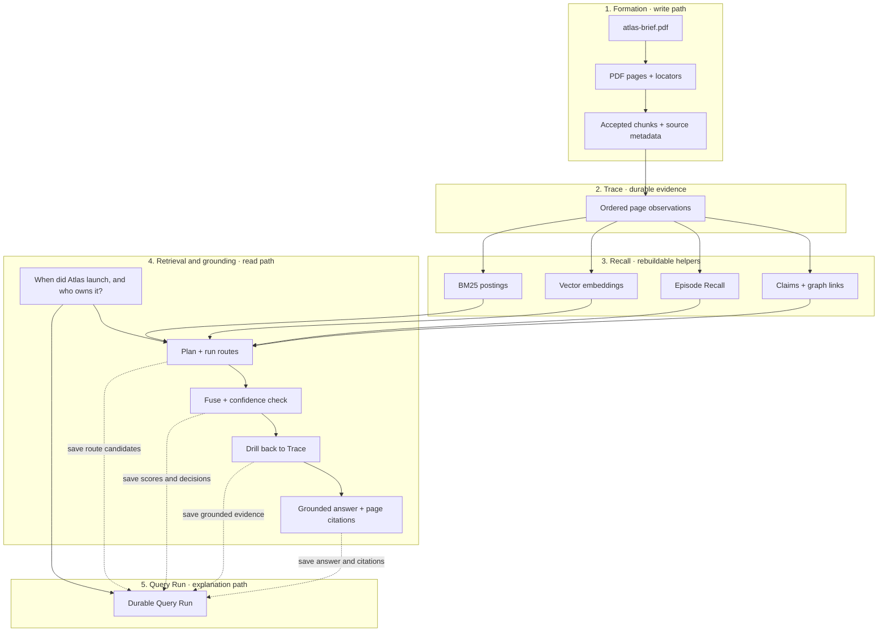

The five boxes are deliberately separate:

- **Formation** decides what may be written.
- **Trace** is the durable evidence produced by Formation.
- **Recall** contains disposable structures that make Trace easier to search.
- **Retrieval and grounding** use Recall to find candidates, then return to Trace before answering.
- **Query Run** records how a read happened; it is diagnostic history, not memory evidence.

### 1. Source processing and Formation

The application submits one typed source:

```python
from trisynapse_memory import MemoryEngine, SourceInput

memory = MemoryEngine.open("./memory")
ingestion = memory.ingest(
    SourceInput(kind="file", path="atlas-brief.pdf", source_key="atlas-brief")
)
```

The PDF loader emits one chunk per non-empty page. The source pipeline retains the original by content hash, adds its page locator, and serially appends the accepted chunks.

| Chunk | Text | Locator |
|---|---|---|
| Page 1 | Project Atlas launched on 14 May 2026. | `{"kind": "page", "page": 1}` |
| Page 2 | Maya Chen is the owner of Project Atlas. | `{"kind": "page", "page": 2}` |

### 2. Trace: what becomes evidence

The two chunks become separate `observation` deltas in one source episode. A simplified view is:

```json
[
  {
    "id": "d_page_1",
    "seq": 41,
    "kind": "observation",
    "episode_id": "source:src_atlas:v1",
    "text": "Project Atlas launched on 14 May 2026.",
    "locator": {"kind": "page", "page": 1}
  },
  {
    "id": "d_page_2",
    "seq": 42,
    "kind": "observation",
    "episode_id": "source:src_atlas:v1",
    "text": "Maya Chen is the owner of Project Atlas.",
    "locator": {"kind": "page", "page": 2}
  }
]
```

If a completion model is configured, Formation can append evidence-linked extraction deltas:

```json
[
  {
    "id": "d_fact_launch",
    "kind": "extraction",
    "text": "Project Atlas launched on 14 May 2026.",
    "subject": "Project Atlas",
    "relation": "launched_on",
    "object": "14 May 2026",
    "evidence_refs": ["d_page_1"]
  },
  {
    "id": "d_fact_owner",
    "kind": "extraction",
    "text": "Maya Chen owns Project Atlas.",
    "subject": "Project Atlas",
    "relation": "owned_by",
    "object": "Maya Chen",
    "evidence_refs": ["d_page_2"]
  }
]
```

The observation remains the original document evidence. The extraction is another Trace record that says exactly which observation supports it. If no completion model is configured, the observations are still stored and searchable; only model-backed extraction is skipped. For the remaining example, assume that a completion model is configured and the extraction and Episode Recall jobs have completed.

### 3. Recall: what gets built for fast lookup

Recall builds several helpers over those Trace IDs:

| Recall component | Example output | Why it exists |
|---|---|---|
| Retrieval document | Text, modality `document`, page locator, source fields | Gives every source a common searchable shape without losing structure |
| BM25 postings | `atlas → d_page_1, d_page_2`; `owner → d_page_2` | Finds exact names and terms |
| Vector cache | Embeddings keyed by text hash and model fingerprint | Finds similar meaning when words differ |
| Episode Recall | “Atlas launch and ownership: launched 14 May 2026; owned by Maya Chen.” | Routes broad questions toward this episode |
| Compiled claims | `Project Atlas —owned_by→ Maya Chen` | Groups compatible extracted facts and exposes conflicts |
| Graph edges | source → observation → extraction → claim | Supports neighborhood and multi-hop retrieval |

Every helper points back to Trace. Episode Recall and compiled claims may help choose an area to search, but they are not accepted as final evidence by themselves.

### 4. Retrieval: what happens for a question

Now the user asks:

```text
When did Project Atlas launch, and who owns it?
```

The engine creates a durable Query Run before retrieval starts. The intermediate steps for this example look like this:

| Step | Example intermediate output |
|---|---|
| Input | Original query recorded for the durable Query Run |
| Classification | `query_kind=temporal`, `profile=balanced`; all enabled routes run, with useful results here from BM25, semantic, temporal, graph, and document routes |
| Index snapshot | Trace cutoff `44`; two observations, two extractions, one Episode Recall view |
| BM25 route | `d_page_2` for “owner”; `d_page_1` for “launch” and “date” |
| Semantic route | Both page observations plus the two linked extractions |
| Temporal route | `d_page_1` and `d_fact_launch` because they carry the launch date |
| Graph route | Owner and launch extraction nodes connected through their shared `Project Atlas` entity |
| Fusion | One ranked candidate list produced from the enabled route weights |
| Confidence | Top score, margin, and evidence agreement pass the configured gate |
| Grounding | Helper nodes are drilled down to `d_page_1` and `d_page_2`; token and per-source limits are applied |

The route outputs are candidate lists, not five answers. Weighted rank fusion combines their ranks, and the grounding stage resolves claims or Episode Recall views back to their supporting observation or extraction deltas.

If confidence had remained low, the saved workflow could contain up to two refinement rounds. With Deep Recall enabled, a low-confidence or multi-hop question can also run a wider search and one extra graph hop. Those stages are conditional, so they do not appear in every Query Run.

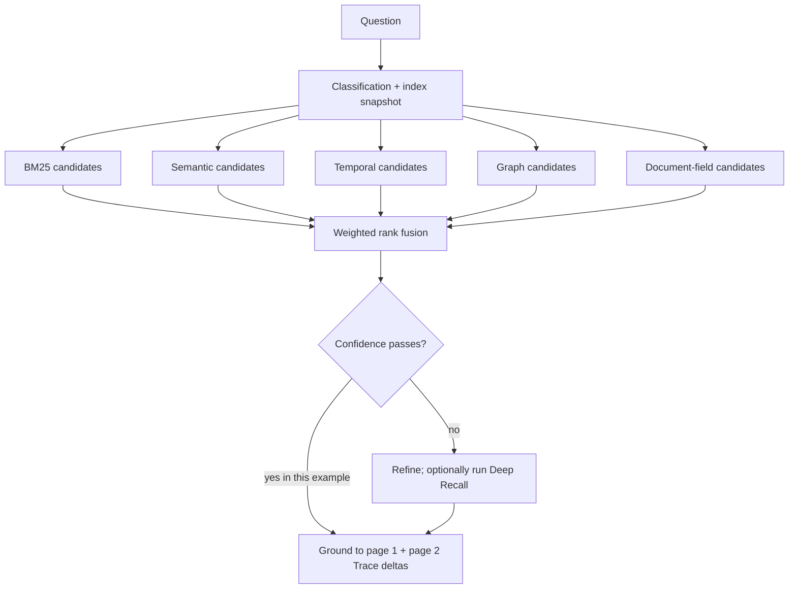

### 5. Grounded answer and citations

Only the grounded Trace records enter the answer context. The result can be:

```json
{
  "answer": "Project Atlas is owned by Maya Chen and launched on 14 May 2026.",
  "abstain": false,
  "citations": [
    {"delta_id": "d_page_2", "locator": {"kind": "page", "page": 2}},
    {"delta_id": "d_page_1", "locator": {"kind": "page", "page": 1}}
  ]
}
```

If the owner page were missing, the engine should not fill the gap from general model knowledge. It should answer only the supported part or abstain, depending on the evidence and configured threshold.

### 6. Query Run: how the process remains inspectable

The Query Run stores the question, effective retrieval configuration, executed steps, bounded candidate snapshots, timings, branch decisions, final answer, citations, and provider/prompt provenance. Studio reads this record to reopen the same workflow later.

It does **not** store embeddings, API keys, authorization headers, full system prompts, or hidden model reasoning. Removing query history deletes these diagnostics; it does not remove the document from Trace.

The central rule illustrated by the whole example is: **Recall may point to an answer, but Trace must support it.**

## What a Trace delta contains

A delta is one ordered memory record. Useful fields include:

- a stable ID and sequence number;
- the text;
- event kind, time, actor, and namespace;
- source and exact locator, such as a PDF page or code line range;
- evidence links and structured payload.

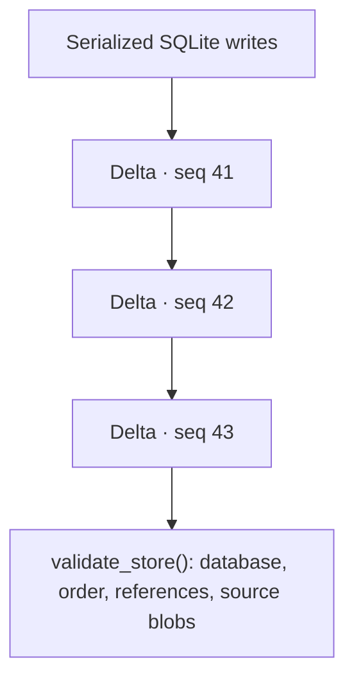

### Ordering and validation

Trace rows are ordered by a unique sequence number assigned inside the same SQLite transaction that writes the row. Stable IDs connect observations, extractions, retractions, citations, and sources. This is enough for normal memory lifecycle operations without making every write depend on the previous row.

`validate_store()` performs practical store checks. The CLI exposes the same operation as `trisynapse-memory validate`:

- SQLite's own consistency check succeeds;
- sequence numbers are contiguous;
- evidence references point to existing deltas;
- retained source files exist and still match their recorded SHA-256 values.

This validation catches corruption, incomplete data relationships, and missing or changed source blobs. It is not a cryptographic audit ledger and does not prove that a database administrator never changed a row. If that threat model matters, protect backups and audit exports with an external signed or append-only system.

SHA-256 remains useful for content identity, so Trisynapse uses it for source deduplication and blob checking, source version detection, file provenance, cache keys, endpoint fingerprints, and prompt provenance. These hashes do not link Trace deltas together and do not hide sensitive content.

Physical removal redacts only the requested rows in one transaction, invalidates affected Recall data, and records the operation in `removal_audit`. Older stores are migrated in place: delta IDs, order, timestamps, links, snapshots, and historical `[PURGED]` payloads stay unchanged while obsolete chain-only columns are dropped.

## Formation: turning input into Trace

Formation is the write path.

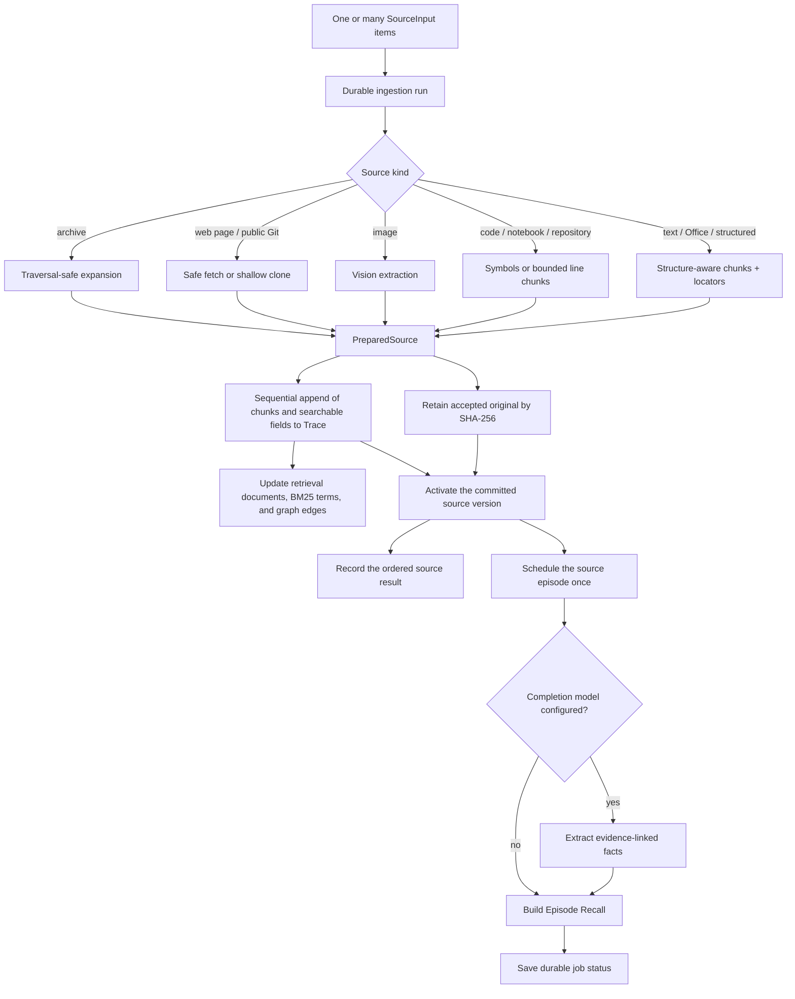

### Unified sources

`SourceInput` describes one item. `ingest()` handles one; `ingest_many()` handles a mixed list. Each result keeps its input index, so successes and failures remain ordered.

Preprocessing uses at most four workers. Trace writes stay sequential so every committed delta receives one unambiguous sequence number. A broken PDF therefore does not roll back a valid code repository in the same run.

Runs and item results live in SQLite. REST can return a run ID immediately, Studio can follow it, and interrupted or failed work can be retried after restart.

### Retained originals and versions

Accepted originals are stored by SHA-256 under `sources/sha256/`. Directories and repositories become safe packages containing only accepted files.

For a stable `source_key`:

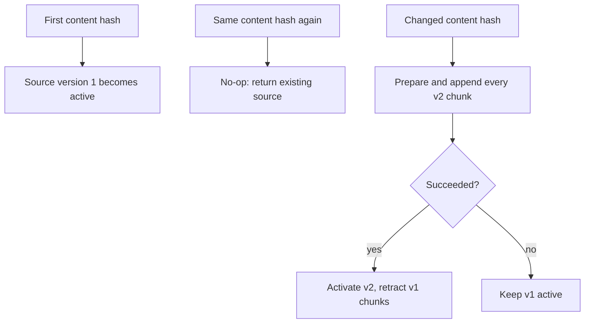

This order avoids losing a working source because its replacement failed.

### Code is not ordinary prose

Fixed character chunks often split a function in half. Trisynapse uses Tree-sitter where a parser is available and keeps symbols together. Python also has a built-in AST path. Unsupported languages fall back to bounded line chunks.

A code citation can carry:

```json
{
  "path": "src/payments.py",
  "language": "py",
  "symbol": "capture_payment",
  "symbol_kind": "function",
  "start_line": 41,
  "end_line": 79,
  "metadata": {
    "imports": ["from decimal import Decimal"],
    "file_hash": "…"
  }
}
```

Git sources also carry the resolved commit SHA and remote URL. One manifest observation lists every accepted repository path. `.gitignore` and `.trisynapseignore` are honored; dependencies, builds, caches, secrets, binaries, and symlinks are skipped and reported.

### Images

An image is sent to the configured completion model with a versioned extraction prompt. The result describes visible text, the scene, tables/charts, and important relationships. That extracted text is written to Trace as source content.

There is no hidden OCR fallback. If the provider or model lacks vision support, that source fails clearly while other items in the run may still succeed.

### One searchable shape, without flattening everything

Every Trace-backed item also gets a rebuildable `RetrievalDocument`. It keeps the original text plus named fields and a broad modality:

| Source | Modality | Example searchable fields |
|---|---|---|
| Code | `code` | path, language, symbol, imports, code |
| CSV/XLSX | `table` | sheet, row, headers, record |
| PDF/DOCX/PPTX/HTML | `document` | title, page, slide, section, path |
| Image | `image` | filename, visible text, description |
| Messages | `conversation` | speaker, message |

This is different from converting every input to anonymous prose. A semantic route can search all text, while a code route can give extra weight to an exact symbol or path. Search hits return their modality, source type, and retrieval fields in `metadata`. Applications should sanitize sensitive values before submitting text, metadata, locators, or retrieval fields.

## Recall: fast help that can be rebuilt

Trace is the authority, but scanning and rebuilding every row for every question is slow. Recall maintains smaller views as data is written:

- keyword and vector indexes;
- Episode Recall summaries;
- evidence-linked claims;
- graph relations and profiles.

These products store links back to source delta IDs. They can be stale, deleted, or rebuilt without losing original evidence.

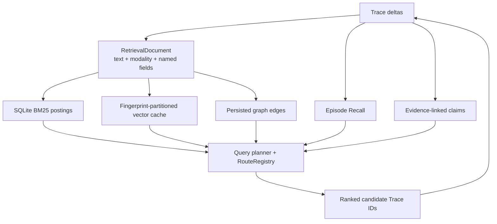

SQLite keeps searchable documents, BM25 postings, and graph edges incrementally. The vector backend adds each new embedding under the active provider/endpoint/model fingerprint and uses its nearest-neighbor index when available. A retraction deactivates its target postings and edges; physical removal deletes them. Opening an older store backfills these disposable tables without editing historical deltas.

Durable jobs run extraction and compilation. Their state and errors survive restarts. This makes provider failures visible without losing the observation that triggered the job.

## Two model roles, one store-wide setting

Trisynapse uses models for two different jobs:

- The **completion model** reads or writes text. It can extract facts, summarize an episode, answer a grounded question, or describe an image.
- The **embedding model** turns text into vectors. Retrieval compares these vectors to find related evidence.

They do not need to come from the same provider.

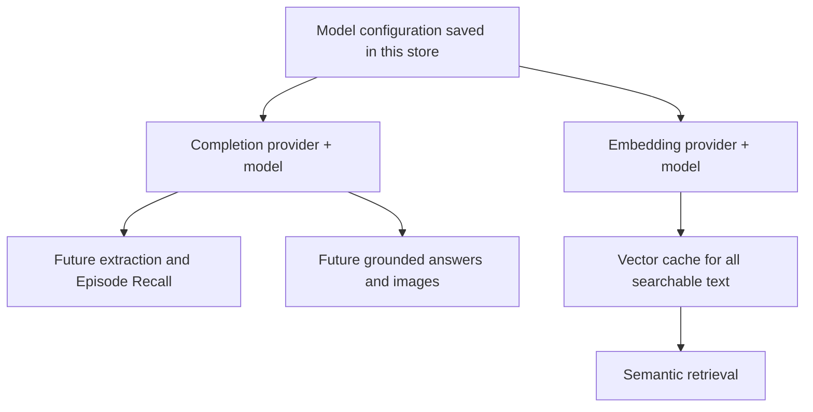

Only the provider name, model ID, optional endpoint, revision, and update time are saved. API keys stay in environment variables. This lets the terminal, Python, REST, TypeScript, and Studio read the same choice without copying secrets into SQLite.

### Why completion changes are immediate

Changing completion does not change old evidence or old generated records. It simply changes the model used by the next provider-backed operation. Each generated artifact records its provider, model, prompt version, and prompt hash, so old and new results remain explainable.

### Why embedding changes rebuild first

Vectors from different models do not share one coordinate system. Comparing a query vector from model B with stored vectors from model A would produce meaningless scores. Trisynapse therefore never activates an embedding change until every searchable item has a compatible replacement vector.

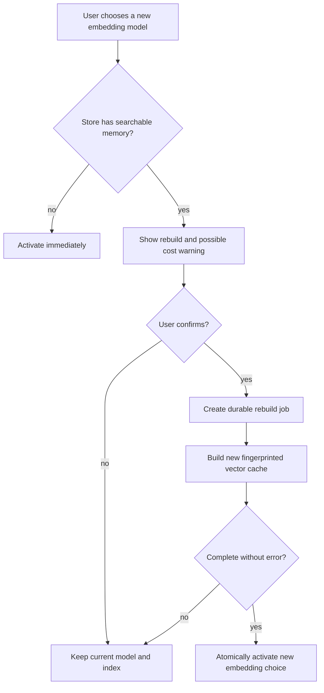

The active index continues serving queries during the rebuild. The cache identity includes provider, normalized endpoint hash, and model, preventing two services with the same model name from accidentally sharing vectors. Another process notices the new configuration revision before its next provider-backed operation, so a server restart is not required.

## Retrieval: plan, route, drill down, answer

Retrieval is not a benchmark script. `MemoryEngine.search()` and `query()` both run this production path.

The default query planner identifies the question shape and useful source modalities. It returns a `QueryPlan`, then an ordered `RouteRegistry` runs independent routes:

- BM25 postings for exact terms;
- vector nearest neighbors for meaning;
- temporal anchors and event time;
- persisted graph neighbors;
- field-aware code, table, image, document, and conversation routes.

Applications may provide another `QueryPlanner`, register a new `RetrievalRoute`, or replace an existing route. The benchmark adapters only translate benchmark records into ordinary sources; they do not control production ranking.

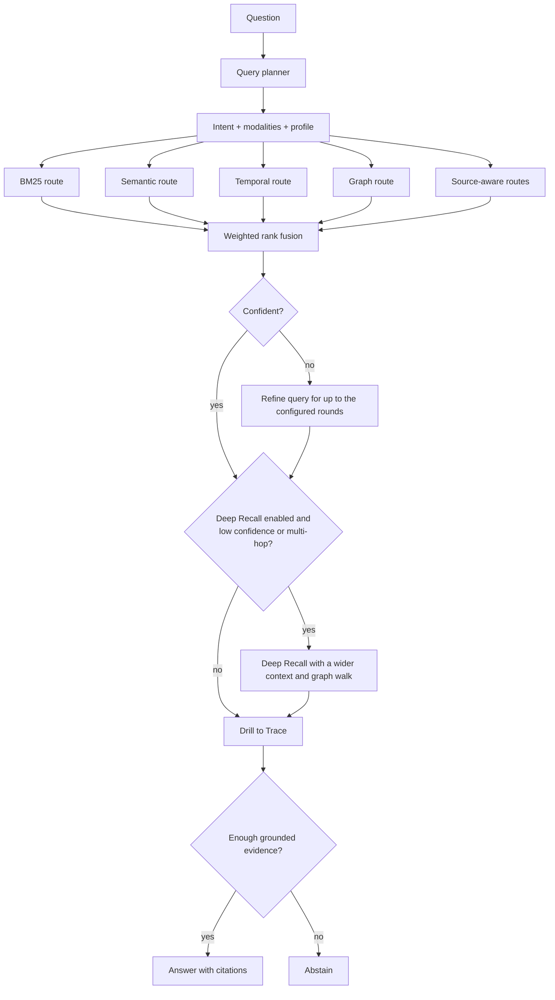

`retrieval_profile` selects a balanced, precise, broad, mixed, or modality-focused set of route weights. `auto` lets the planner select a profile from the question. `route_weights` can override individual routes, and `enabled_routes` can disable routes for a store. The saved configuration and the effective query plan are captured in the durable query run.

Episode summaries are routing hints. They are not placed into final answer context as unsupported truth. `retrieval_trace` exposes the chosen stage, routes, scores, seeds, and number of drilled Trace records.

For multi-hop questions, extraction records connect through shared subjects and objects. A query can therefore walk `person → event → outcome` even when no single observation contains every word in the question. Compiled claims and Episode Recall locate a useful region; the engine then reranks the supporting observations against the original question. It does not simply return an entire episode.

Context selection is bounded twice: by record count and by tokens. The default answer window allows at most 24 records and 6,000 tokens, with 2,000 tokens per source. Trisynapse uses a provider-supplied local counter when available, Tiktoken for recognized OpenAI models when the `tokens` extra is installed, and an explicitly labelled provider-aware Unicode estimate otherwise. The query workflow records the counter name and whether it was exact. Applications can supply their own `TokenCounter`. This keeps one large PDF, repository, or conversation from crowding every other source out of the answer. Ordinary `search()` still defaults to 12 results.

Retrieval math has one implementation per formula. SQLite and in-memory BM25 call the same Okapi BM25 primitive. Pairwise and fallback nearest-neighbor cosine scoring use shared NumPy functions. LanceDB queries explicitly request cosine distance and convert cosine distance to similarity with `1 - distance`. Weighted rank fusion follows `weight / (60 + rank + 1)` and is independently tested.

Each extracted fact records the smallest supporting set of stable observation IDs. Those references flow into compiled claims, graph edges, grounding, and citations. This is why a derived fact can route efficiently without becoming a replacement for its original evidence.

### Query runs: the inspectable retrieval record

A query does not become evidence. Instead, Trisynapse stores it in a separate, removable **Query Run** record. This keeps Trace focused on memory while still letting Studio reopen exactly how an answer was found.

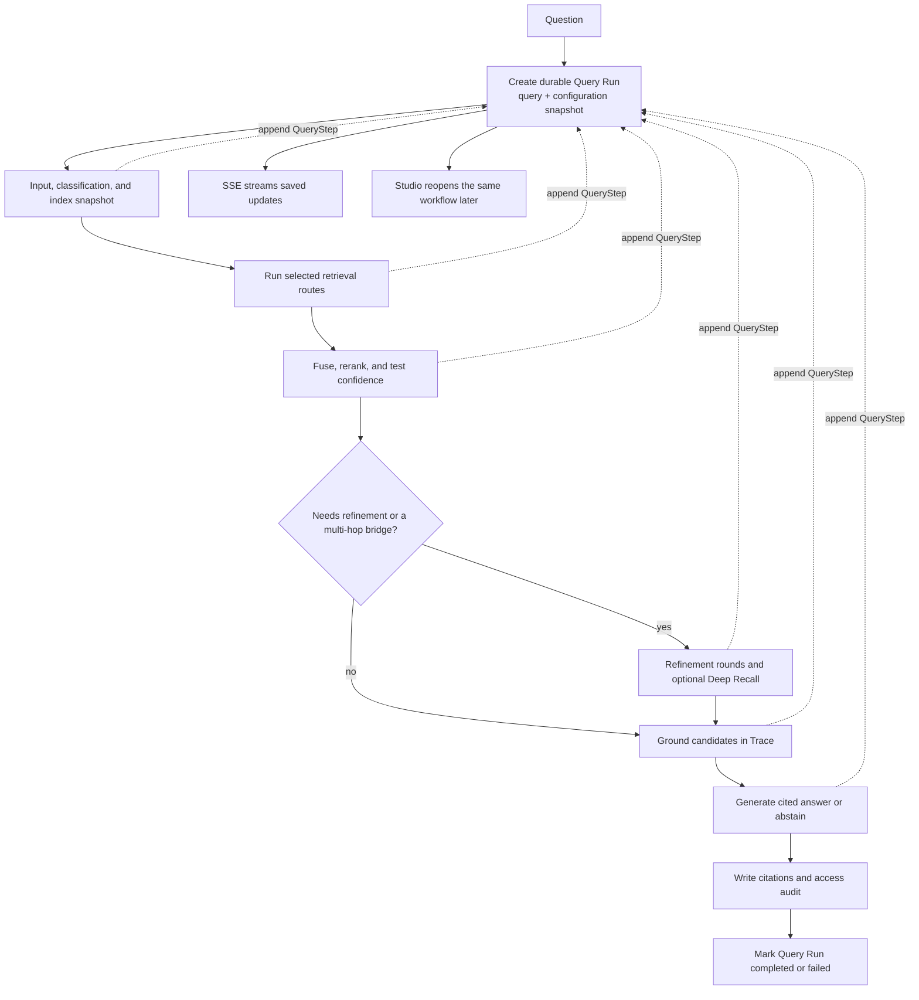

Every executed box is stored as a `QueryStep`. Each route keeps at most 20 safe candidate snapshots, not the whole index. Embedding vectors, credentials, authorization headers, full prompts, and private model reasoning are never stored. Query history remains until explicitly removed. The Trace access event keeps the query ID and citations, but not the question text.

`query()` also returns `retrieval_hits`. They are the pre-answer grounded records and remain available when the completion model abstains. `citations` describe what the final answer used; `retrieval_hits` describe what retrieval found. Keeping them separate makes both Studio diagnostics and benchmarks honest.

### Memory Viewer

Studio's home is Memory Viewer. `GET /api/v1/memory/catalog` lists Trace, every Recall helper, and every retrieval route the running engine actually has. Tabs, health chips, playground route filters, and Configuration's route editors are generated from that catalog — not a hardcoded page list.

Each helper declares a visual family (`timeline`, `table`, `postings`, `embedding`, `cards`, `graph`). Studio registers specialized renderers locally; an unknown helper id still renders the family view from generic `items[]`. Deep links stay stable: `/studio/memory?helper=bm25&id=atlas`.

The Graph tab keeps three architecture views over the same Trace and Recall data, plus the retrieval graph the graph route actually walks:

| View | Starts from | Makes clear |
|---|---|---|
| Knowledge | Concepts and compiled claims | What Trisynapse currently knows and which relationship joins two concepts |
| Lineage | Sources, Trace chunks, extractions, claims, and Episode Recall | Where a derived memory came from and which original evidence grounds it |
| Retrieval | `followed_by` and `about_same_entity` edges | How the graph route expands candidates |
| Trace (timeline tab) | Ordered deltas grouped by source or episode | What was written, corrected, retracted, or accessed over time |

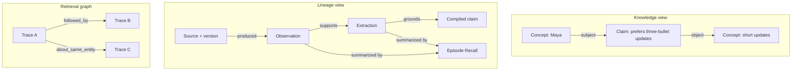

The retrieval playground runs production `search(persist=false)` from the current selection so inspection does not fill Query history. "Open as Query" is the only path that writes a Query Run.

Large stores open as a bounded overview. Search and neighbor expansion make every visible-namespace node reachable without drawing an unreadable graph all at once.

## Namespaces

Every public operation uses a namespace:

```text
user_id / agent_id / project_id / session_id
```

`project_id` defaults to `default`. Other fields are optional. A write under one namespace is not visible from another. Stable namespace values matter more than filling every field.

## Correct, forget, and remove

These operations solve different problems:

| Operation | What happens | Old content remains? | Use when |
|---|---|---:|---|
| `correct()` | Append linked corrected evidence | Yes | The old statement was wrong or incomplete |
| `forget()` | Append a logical retraction | Yes, for authorized history | Memory should stop using it |
| `remove()` | Redact selected delta fields and clear affected Recall data | No | Physical deletion is required |
| `remove_source()` | Remove an unshared retained blob and all derived deltas | No | Delete one imported source completely |

Delta-only removal does not silently delete a larger source package. Conversely, source removal is intentionally larger: it redacts all chunks derived from that source.

Historical stores may contain `[PURGED]` rows. Migration never rewrites them; new operations use `[REMOVED]` and removal terminology.

## Storage map

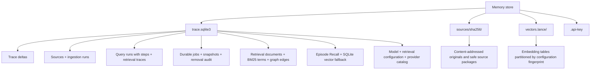

SQLite uses WAL, full synchronous writes, and secure deletion. Trace writes are serialized. Vector storage is only a cache. Backups include SQLite, source blobs, and rebuildable products.

Source files are permission-restricted but not encrypted. Use an encrypted disk or storage layer when required.

## Code map

The engine folders use the same names as the architecture. `MemoryEngine` is the
public orchestrator; shared contracts and utilities remain at the engine root.

```text
engine/
├── memory.py                 public orchestration
├── models.py                 shared contracts
├── utils.py                  shared numerical and version helpers
├── formation/                source preparation and evidence creation
├── trace/                    durable ordered evidence
├── recall/                   rebuildable views and vector caches
├── retrieval/                planning, ranking, grounding, and context
└── providers/                completion and embedding integrations
```

| Area | Path | Responsibility |
|---|---|---|
| Public engine | `src/trisynapse_memory/engine/memory.py` | Lifecycle, ingestion runs, retrieval, backups |
| Shared contracts | `engine/models.py` | Public models used across every architecture component |
| Shared utilities | `engine/utils.py` | Runtime version lookup, NumPy cosine, shared BM25, weighted reciprocal-rank fusion |
| Formation pipeline | `engine/formation/pipeline.py` | Observation and evidence-linked extraction writes |
| Formation sources | `engine/formation/sources.py` | Loaders, safety rules, retained blobs, code/image/archive handling |
| Trace | `engine/trace/store.py` | SQLite, ordered deltas, jobs, sources, query runs, validation, removal audit |
| Recall compilation | `engine/recall/compilation.py` | Claims and Episode Recall |
| Recall vectors | `engine/recall/vector_cache.py` | Rebuildable SQLite and LanceDB vector caches |
| Retrieval contracts | `engine/retrieval/contracts.py` | Canonical documents, query planner, route interface, registry, profiles |
| Retrieval execution | `engine/retrieval/engine.py` | Fusion, confidence, Trace drill-down, context budgeting |
| Retrieval tokenization | `engine/retrieval/tokenization.py` | Unicode/code lexical tokens and replaceable context token counters |
| Provider registry | `engine/providers/registry.py` | Completion, vision, discovery, and model configuration |
| Provider embeddings | `engine/providers/embedding.py` | Local and remote embedding integrations |
| Prompt package | `prompts/` | Versioned production prompts |
| REST/Studio | `api.py`, `studio/` | Service and browser UI |
| Terminal/CLI | `cli.py`, `terminal.py` | Scriptable and interactive operations |
| Adapters | `adapters/` | Agent events, Trisynapse, benchmark formats |

## Invariants worth remembering

1. Trace is the evidence; Recall is a rebuildable helper.
2. Accepted content is stored as supplied; applications sanitize sensitive input before ingestion.
3. Store validation checks SQLite, sequence continuity, evidence links, and retained source blobs; it is not a tamper-proof ledger.
4. Retrieval drills down to Trace before answering.
5. Mixed sources fail independently, but Trace writes remain sequential.
6. A replacement source becomes active only after successful processing.
7. Forget is logical; remove is physical.
8. The system should abstain when evidence is not strong enough.
9. Completion changes affect future generation; embedding changes activate only after a confirmed successful rebuild.
10. Source modalities and fields survive ingestion; final answers still cite Trace.

Continue with [API and Interfaces](api.md) for code examples or [Operations](operations.md) for installation, security, and recovery.
